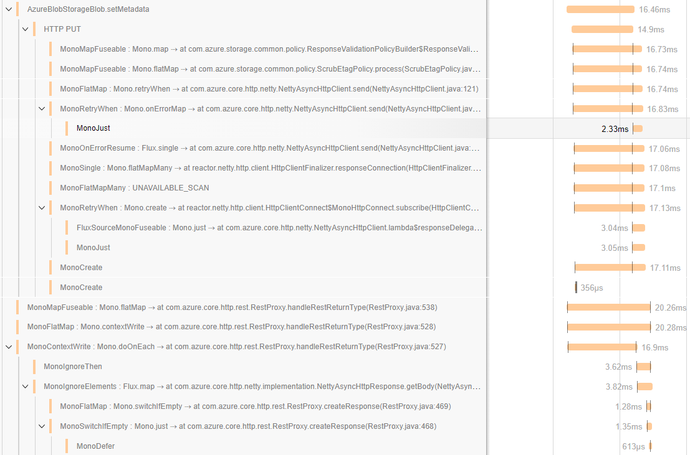

# Library for debugging Reactor calls with OpenTelemetry

This library helps to understand [Project Reactor](https://projectreactor.io/) call chains. Is't intended for debugging only. **Do not use it in production**: it will kill your app performance.
If you're trying to understand complicated call chains and what causes what or learning Reactor like me - welcome in, this library is for you.

Check out [OpenTelemetry project](https://opentelemetry.io/) to learn more about it.

## Usage

You'll need Java 11 or higher and Maven to build it. Once you're done, make sure to remove the `ReactorTracer.enable()` call!

1. Clone this repo
2. `mvn install` this project
3. Add dependency to your project

```xml
<dependency>
    <groupId>com.reactor.debug</groupId>
    <artifactId>opentelemetry-reactor-3-debug</artifactId>
    <version>{latest}</version>
</dependency>
```

4. If you don't have OpenTelemetry - add dependencies (please add [OpenTelemetry BOM](https://opentelemetry.io/docs/instrumentation/java/#maven))

```xml
<dependency>
  <groupId>io.opentelemetry</groupId>
  <artifactId>opentelemetry-sdk</artifactId>
</dependency>

<!-- add exporter of your choice-->
<dependency>
  <groupId>io.opentelemetry</groupId>
  <artifactId>opentelemetry-exporter-jaeger</artifactId>
</dependency>
```

5. Set up OpenTelemetry (if you didn't) and enable Reactor tracing.

```java
SdkTracerProvider sdkTracerProvider = SdkTracerProvider.builder()
    .setResource(Resource.builder().put("service.name", "  ").build())
    .addSpanProcessor(SimpleSpanProcessor.create(JaegerGrpcSpanExporter.builder().build()))
    .build();

OpenTelemetry sdk = OpenTelemetrySdk.builder()
    .setTracerProvider(sdkTracerProvider)
    .setPropagators(ContextPropagators.create(W3CTraceContextPropagator.getInstance()))
    .buildAndRegisterGlobal();

// magic starts here - don't forget to remove it once you're done debugging
ReactorTracer.enable(sdk.getTracerProvider()); 
// do what you want to trace

// you can disable it when done to limit the noise
ReactorTracer.disable(); 
```

6. Check out the traces. Here's what I've got:



## Contributing

My plan is to move it to [OpenTelemetry Java Contrib](https://github.com/open-telemetry/opentelemetry-java-contrib) shortly. If you want to contribute issues, PRs or ideas before that - please do!
